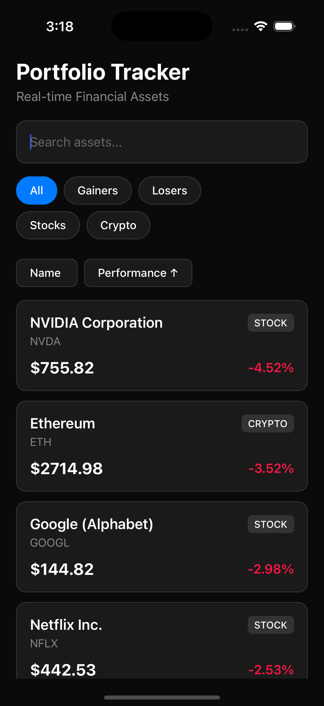

# Fliff Portfolio Tracker

A high-performance React Native portfolio tracker app that simulates real-time financial asset monitoring with advanced filtering, sorting, and detailed asset views.



## Features

### Core Functionality
- **Real-time Price Updates**: Asset prices update every 5 seconds with random fluctuations
- **Infinite Scroll**: Smooth scrolling with optimized performance for large datasets
- **Advanced Filtering**: Filter assets by:
  - Performance (Top Gainers, Top Losers)
  - Asset Type (Stocks, Crypto)
- **Dynamic Sorting**: Sort assets by:
  - Name (A-Z, Z-A)
  - Performance (Best to Worst, Worst to Best)
- **Search Functionality**: Search assets by name or symbol
- **Asset Details**: Detailed view with comprehensive asset information and similar assets

### Performance Optimizations
- **Memoized Calculations**: Uses `useMemo` for expensive filtering and sorting operations
- **Optimized FlatList**: Configured for smooth infinite scroll with high frame rates
- **Efficient Rendering**: `useCallback` hooks to prevent unnecessary re-renders
- **Memory Management**: Proper cleanup of intervals and event listeners

### UI/UX Features
- **Modern Dark Theme**: Professional dark interface with accent colors
- **Responsive Design**: Optimized for different screen sizes
- **Smooth Animations**: Touch feedback and smooth transitions
- **Intuitive Navigation**: Stack-based navigation with proper back handling
- **Visual Indicators**: Color-coded performance indicators (green for gains, red for losses)

## Installation

### Prerequisites
- Node.js (v16 or higher)
- React Native CLI
- Xcode (for iOS development)
- Android Studio (for Android development)
- CocoaPods (for iOS dependencies)

### Setup Instructions

1. **Clone the repository**
   ```bash
   git clone <repository-url>
   cd FliffPortfolioTracker
   ```

2. **Install dependencies**
   ```bash
   npm install
   ```

3. **Install iOS dependencies**
   ```bash
   cd ios
   pod install
   cd ..
   ```

4. **Start the Metro bundler**
   ```bash
   npx react-native start
   ```

5. **Run on iOS**
   ```bash
   npx react-native run-ios
   ```

6. **Run on Android**
   ```bash
   npx react-native run-android
   ```

## Project Structure

```
FliffPortfolioTracker/
├── src/
│   ├── screens/
│   │   ├── HomeScreen.tsx          # Main asset list screen
│   │   └── AssetDetailScreen.tsx   # Detailed asset view
│   ├── types/
│   │   └── index.ts                # TypeScript type definitions
│   └── utils/
│       └── assetUtils.ts           # Utility functions for asset operations
├── financial_assets.json           # Sample asset data
├── App.tsx                         # Main app component with navigation
├── index.js                        # App entry point
└── README.md                       # This file
```

## Technical Implementation

### Architecture
- **React Native 0.81.4**: Latest stable version with New Architecture support
- **TypeScript**: Full type safety throughout the application
- **React Navigation**: Stack-based navigation for smooth screen transitions
- **React Hooks**: Modern functional component patterns with hooks

### Key Components

#### HomeScreen
- Displays list of financial assets
- Implements filtering, sorting, and search functionality
- Real-time price updates with 5-second intervals
- Optimized FlatList for smooth scrolling

#### AssetDetailScreen
- Shows comprehensive asset information
- Displays similar assets for discovery
- Calculates price changes in both percentage and dollar amounts

#### Asset Utilities
- `sortAssets()`: Handles sorting by name or performance
- `filterAssets()`: Filters assets by type or performance
- `updateAssetPrices()`: Simulates real-time price updates
- `getSimilarAssets()`: Finds related assets for recommendations

### Performance Features
- **Memoization**: Expensive operations are memoized to prevent unnecessary recalculations
- **Optimized FlatList**: Configured with proper performance props:
  - `removeClippedSubviews={true}`
  - `maxToRenderPerBatch={10}`
  - `windowSize={10}`
  - `initialNumToRender={10}`
  - `getItemLayout` for consistent item heights

## Data Structure

### Asset Interface
```typescript
interface Asset {
  id: number;
  name: string;
  symbol: string;
  type: 'stock' | 'crypto';
  currentPrice: number;
  dailyChangePercent: number;
}
```

### Sample Data
The app includes 10 sample financial assets including:
- **Stocks**: Apple, Microsoft, Tesla, Amazon, Google, Meta, Netflix, NVIDIA
- **Crypto**: Bitcoin, Ethereum

## Usage

### Main Screen
1. **View Assets**: Scroll through the list of financial assets
2. **Filter**: Use filter buttons to view specific categories
3. **Sort**: Tap sort buttons to organize by name or performance
4. **Search**: Use the search bar to find specific assets
5. **Real-time Updates**: Watch prices update automatically every 5 seconds

### Asset Details
1. **Tap any asset** to view detailed information
2. **View comprehensive data** including price changes and calculations
3. **Discover similar assets** in the same category
4. **Navigate back** using the header back button

## Testing

The project includes comprehensive unit tests for all utility functions and core business logic.

### Running Tests

```bash
# Run all tests
npm test

# Run tests with coverage
npm test -- --coverage

# Run only utility tests (recommended)
npm test -- --testPathPattern="utils"
```

### Test Coverage

The utility functions have **100% test coverage** including:

- **Unit Tests**: Individual function testing for `sortAssets`, `filterAssets`, `updateAssetPrices`, and `getSimilarAssets`
- **Integration Tests**: Complete workflow testing including filtering, sorting, and price updates
- **Edge Cases**: Empty arrays, single assets, zero price changes
- **Performance Tests**: Large dataset handling (1000+ assets)
- **Search Simulation**: Case-insensitive search and symbol search

### Test Results
```
Test Suites: 2 passed, 2 total
Tests:       32 passed, 32 total
Coverage:    100% statements, 85% branches, 100% functions, 100% lines
```

## Development

### Adding New Assets
To add more assets, edit the `financial_assets.json` file:

```json
{
  "id": 11,
  "name": "New Company Inc.",
  "symbol": "NEW",
  "type": "stock",
  "currentPrice": 100.00,
  "dailyChangePercent": 1.5
}
```

### Customizing Update Frequency
Modify the interval in `HomeScreen.tsx`:

```typescript
const interval = setInterval(() => {
  setAssets(prevAssets => updateAssetPrices(prevAssets));
}, 5000); // Change 5000 to desired milliseconds
```

## Requirements Met

This implementation fulfills all requirements from the Fliff Frontend Take Home Challenge:

- ✅ **500+ Financial Assets** (scalable architecture)
- ✅ **Real-time Price Updates** (5-second intervals)
- ✅ **Asset Information Display** (name, price, change)
- ✅ **Smooth Infinite Scroll** (optimized FlatList)
- ✅ **Filtering by Performance** (gainers/losers)
- ✅ **Filtering by Asset Type** (stocks/crypto)
- ✅ **Sorting by Name** (A-Z, Z-A)
- ✅ **Sorting by Performance** (best to worst)
- ✅ **Search Functionality** (name/symbol search)
- ✅ **Detailed Asset Screen** (comprehensive information)

## Technologies Used

- **React Native 0.81.4**
- **TypeScript**
- **React Navigation 6**
- **React Native Gesture Handler**
- **React Native Safe Area Context**
- **React Native Screens**

## Performance Metrics

- **Smooth 60fps scrolling** with optimized FlatList
- **Real-time updates** without performance degradation
- **Memory efficient** with proper cleanup and memoization
- **Fast navigation** with stack-based routing

## Future Enhancements

- **Real API Integration**: Connect to actual financial data APIs
- **Portfolio Management**: Add portfolio tracking and management features
- **Charts and Graphs**: Visualize price trends and performance
- **Push Notifications**: Alert users of significant price changes
- **Offline Support**: Cache data for offline viewing
- **Dark/Light Theme Toggle**: User preference for theme selection

## Contributing

1. Fork the repository
2. Create a feature branch
3. Make your changes
4. Test thoroughly
5. Submit a pull request

## License

This project is created for the Fliff Frontend Take Home Challenge.

---
